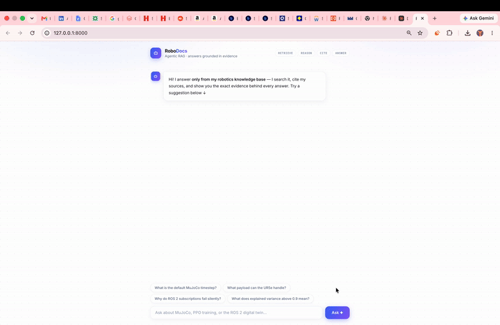

#  Agentic RAG Assistant

**Ask a question. The AI reads the docs, retrieves evidence, reasons over it, and gives you a cited answer — all in one autonomous loop.**

Most chatbots just generate text. This one actually *looks things up first*, decides what tools to use, searches a knowledge base, and only answers when it has evidence — with citations pointing back to the source. If it can't find the answer, it says "I don't know" instead of making things up.

Built with the **Anthropic Claude API**, a custom **RAG pipeline**, and a **FastAPI** backend — fully tested, evaluated, and Dockerized.

---

## 🎬 How It Works (30-Second Version)

```
You ask: "What is the default MuJoCo timestep?"
                    │
                    ▼
         ┌─────────────────────┐
         │   Agent Loop        │
         │                     │
         │  1. Reads question  │
         │  2. Calls search_docs tool ──→ Vector Store (cosine similarity)
         │  3. Gets matching chunks     ←── top-k relevant passages
         │  4. Reasons over evidence    │
         │  5. Returns structured JSON  │
         └─────────────────────┘
                    │
                    ▼
         {
           "answer": "0.002 seconds (500 Hz)",
           "citations": [{"doc_id": "mujoco_basics", "chunk_id": "a3f2b1"}],
           "confidence": "high"
         }
```

**The key insight:** The LLM doesn't just answer from memory — it autonomously decides to search, retrieves real evidence, and grounds its answer in what it actually found. If the docs don't contain the answer, it says so instead of hallucinating.

---

## 📸 Demo UI

The assistant comes with a built-in web console that shows the answer alongside retrieval telemetry (which chunks were retrieved, similarity scores, tool calls made).



> *To add this screenshot: run the app locally, ask a question, and screenshot the web UI at `localhost:8000`*

---

## ✨ What Makes This Different

### It's Agentic, Not Just a Pipeline
Most RAG tutorials do: embed → retrieve → stuff into prompt → generate. That's one-shot and fragile. This system runs an **autonomous multi-turn loop**: the LLM plans which tools to call, executes them, evaluates the results, and can search again if the first retrieval wasn't good enough — all within a hard budget of 6 tool calls to control cost and latency.

### Every Output is Validated
The LLM's response isn't raw text — it's parsed into a **Pydantic schema** with `answer`, `citations`, `confidence`, and `tools_used`. If the model returns malformed JSON, it's caught and surfaced cleanly. Downstream consumers (UIs, logs, evals) always get structured, machine-readable data.

### It Has a Real Evaluation Framework
Not just "it works on my laptop." There's a **labeled eval set** of 8 question-answer pairs, and a harness that measures **Hit@4** and **MRR** (Mean Reciprocal Rank) on every run. The eval has a failing threshold (`Hit@4 < 0.8` = CI failure), so retrieval regressions are caught before they ship.

### The LLM is Fully Mocked in Tests
The agent loop is the riskiest code path. Instead of calling the real API in CI (slow, flaky, expensive), the tests inject a **mock LLM client** that simulates a tool-use turn followed by a final answer. All 5 unit tests run without an API key, in under a second.

---

## 📊 Evaluation Results

| Metric | Score |
|---|---|
| **Hit@4** | 1.00 (every question finds the right doc in top 4) |
| **MRR** | 1.00 (right doc is always rank 1) |
| Eval cases | 8 labeled questions |
| Unit tests | 5 passing (no API key needed) |

---

## 🏗️ Architecture

```
┌──────────────────────────────────────────────────────────────┐
│  FastAPI REST Service (/ask endpoint)                        │
│                                                              │
│  ┌────────────────────────────────────────────────────────┐  │
│  │  RagAgent — Multi-turn Tool-Use Loop                   │  │
│  │                                                        │  │
│  │  Claude API ←→ Tool Router                             │  │
│  │                  ├── search_docs → VectorStore          │  │
│  │                  └── calculate   → Safe math evaluator  │  │
│  │                                                        │  │
│  │  Loop: send → tool_use? → execute → return result      │  │
│  │        repeat until final answer or budget exhausted    │  │
│  └────────────────────────────────────────────────────────┘  │
│                                                              │
│  ┌─────────────────┐  ┌──────────────────────────────────┐  │
│  │  Chunking        │  │  VectorStore                     │  │
│  │  Paragraph-aware │  │  Cosine similarity search        │  │
│  │  with overlap    │  │  NumPy vectors + JSON metadata   │  │
│  │  Pydantic chunks │  │  Chroma/pgvector-compatible API  │  │
│  └─────────────────┘  └──────────────────────────────────┘  │
└──────────────────────────────────────────────────────────────┘
```

### Component Breakdown

| Component | File | What It Does |
|---|---|---|
| **Agent** | `src/rag_agent/agent.py` | Orchestrates the LLM ↔ tool loop, parses structured output |
| **Tools** | `src/rag_agent/tools.py` | `search_docs` (retrieval) and `calculate` (safe arithmetic) |
| **Vector Store** | `src/rag_agent/vectorstore.py` | Cosine search over NumPy embeddings, persist/load to disk |
| **Chunking** | `src/rag_agent/chunking.py` | Splits docs on paragraph boundaries with overlap |
| **Embeddings** | `src/rag_agent/embeddings.py` | Pluggable: `HashingEmbedder` (CI) or `sentence-transformers` (production) |
| **Schemas** | `src/rag_agent/schemas.py` | Pydantic models for chunks, results, API request/response |
| **API** | `src/rag_agent/api.py` | FastAPI service with `/ask`, `/health`, and demo UI |
| **Eval** | `eval/run_eval.py` | Hit@k + MRR harness with CI threshold gate |
| **Tests** | `tests/test_pipeline.py` | 5 unit tests with dependency-injected mock LLM |

---

## 🗂️ Project Structure

```
agentic-rag-assistant/
│
├── src/rag_agent/
│   ├── agent.py              # Multi-turn tool-use loop (core logic)
│   ├── api.py                # FastAPI REST service
│   ├── chunking.py           # Paragraph-aware document splitter
│   ├── embeddings.py         # Pluggable embedders (hashing / sentence-transformers)
│   ├── schemas.py            # Pydantic models for every data boundary
│   ├── tools.py              # Tool schemas + executors (search, calculate)
│   └── vectorstore.py        # Cosine similarity store (NumPy, persistent)
│
├── data/docs/                # Knowledge base (drop your .md/.txt files here)
│   ├── mujoco_basics.md
│   ├── ppo_training.md
│   └── ros2_digital_twin.md
│
├── eval/
│   ├── eval_set.jsonl        # 8 labeled question → expected doc mappings
│   └── run_eval.py           # Hit@k + MRR evaluation harness
│
├── tests/
│   └── test_pipeline.py      # 5 unit tests (chunking, store, tools, agent)
│
├── scripts/
│   ├── ingest.py             # Build the vector index from docs
│   └── ask.py                # CLI: ask a question from terminal
│
├── static/index.html         # Demo web console with retrieval telemetry
├── Dockerfile                # Production container (ingest + serve)
└── requirements.txt
```

---

## 🚀 Quick Start

### 1. Install & Index

```bash
git clone https://github.com/poojithamadhyala/agentic-rag-assistant.git
cd agentic-rag-assistant
pip install -r requirements.txt
python scripts/ingest.py                    # builds vector index from docs
```

### 2. Run Tests (no API key needed)

```bash
python -m pytest tests/ -v                  # 5 tests, all mocked
python eval/run_eval.py --k 4              # retrieval eval: Hit@4, MRR
```

### 3. Ask Questions

```bash
# CLI
export ANTHROPIC_API_KEY=sk-ant-...
python scripts/ask.py "What is the default MuJoCo timestep?"

# REST API
uvicorn rag_agent.api:app --app-dir src
curl -X POST localhost:8000/ask \
  -H 'Content-Type: application/json' \
  -d '{"question": "What payload can the UR5e handle?"}'
```

### 4. Web Console

Start the server and open `http://localhost:8000` — the demo UI shows the answer alongside retrieval telemetry (chunks retrieved, similarity scores, tools called).

### 5. Docker

```bash
docker build -t rag-agent .
docker run -e ANTHROPIC_API_KEY=sk-ant-... -p 8000:8000 rag-agent
```

---

## 🔌 Use Your Own Documents

1. Drop `.md` or `.txt` files into `data/docs/`
2. Re-run `python scripts/ingest.py`
3. Add labeled questions to `eval/eval_set.jsonl`
4. Run `python eval/run_eval.py` to verify retrieval quality

For semantic (meaning-based) retrieval instead of keyword hashing:

```bash
pip install sentence-transformers
python scripts/ingest.py --embedder sentence-transformers
```

---

## 🧠 Design Decisions

| Decision | Why |
|---|---|
| **Dependency-injected LLM client** | The agent loop is the riskiest logic — mocking lets tests exercise the full tool-calling path without API calls, cost, or flakiness |
| **Structured JSON output** | Downstream consumers (UIs, logs, evals) need machine-readable answers with citations — free-text can't be audited or scored |
| **Tool-call budget (6 turns)** | Autonomous loops need hard stops. Bounds cost, latency, and forces graceful degradation |
| **Paragraph-aware chunking** | Splitting on `\n\n` keeps semantic units together. Overlap preserves context across boundaries |
| **Chroma/pgvector-compatible API** | The `VectorStore` interface (add/query/persist/load) mirrors real databases — swap backends without touching the agent |

---

## 🗺️ Roadmap

- [ ] Hybrid retrieval (BM25 + dense) with reciprocal rank fusion
- [ ] LLM-as-judge answer grading in the eval harness
- [ ] Streaming responses via SSE
- [ ] OpenTelemetry tracing on the API
- [ ] Kubernetes manifest for horizontal scaling

---

## Tech Stack

| Category | Technology |
|---|---|
| LLM | Anthropic Claude API (tool use / function calling) |
| Backend | Python, FastAPI, Pydantic |
| Retrieval | Custom vector store (NumPy cosine similarity) |
| Embeddings | HashingEmbedder (CI) / sentence-transformers (production) |
| Testing | pytest, dependency-injected mock LLM |
| Evaluation | Custom harness: Hit@k, MRR, CI threshold gates |
| Infrastructure | Docker, uvicorn |

---

## Author

**Poojitha Madhyala**
M.S. Robotics & AI, Arizona State University

[LinkedIn](https://linkedin.com/in/poojitha-madhyala) · [GitHub](https://github.com/poojithamadhyala) · [Portfolio](https://poojithamadhyala.github.io)
